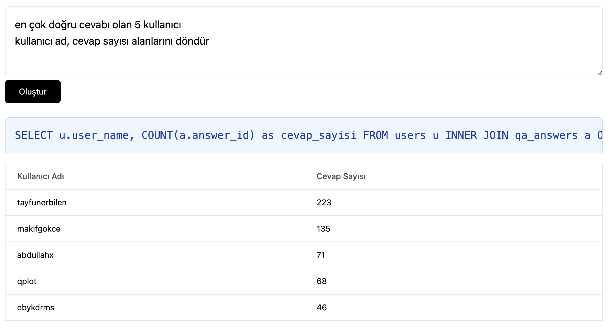

# ChatGPT Rapor Uygulaması

Veritabanı şemanıza göre rapor oluşturmanızı sağlayan basit bir uygulama

Çalıştırmak için `server/.env` içindeki gerekli alanları doldurun.

Ve paketleri yükleyerek client'ı `npm run dev` ve server'ı `npm start` olarak çalıştırın.
